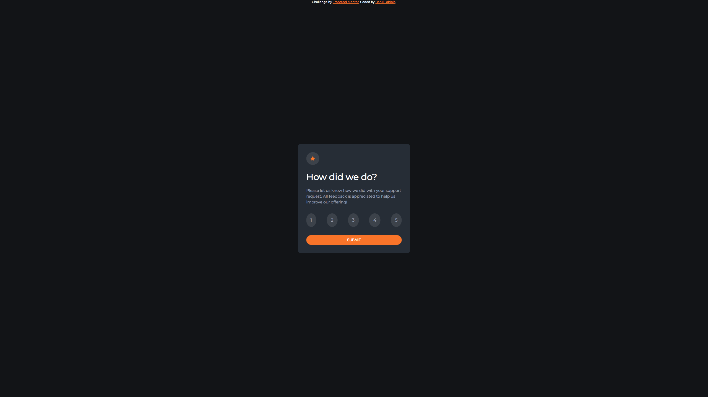

# Frontend Mentor - Interactive rating component solution

This is a solution to the [Interactive rating component challenge on Frontend Mentor](https://www.frontendmentor.io/challenges/interactive-rating-component-koxpeBUmI). Frontend Mentor challenges help you improve your coding skills by building realistic projects. 

## Table of contents

  - [The challenge](#the-challenge)
  - [Screenshot](#screenshot)
  - [Links](#links)
  - [My process](#my-process)
  - [Built with](#built-with)
  - [What I learned](#what-i-learned)
  - [Useful resources](#useful-resources)
  - [Author](#author)
  - [Acknowledgments](#acknowledgments)

### The challenge

Users should be able to:

- View the optimal layout for the app depending on their device's screen size
- See hover states for all interactive elements on the page
- Select and submit a number rating
- See the "Thank you" card state after submitting a rating

### Screenshot

### Links

- Solution URL: (https://github.com/Fabiola971/RatingComponent)
- Live Site URL: (https://fabiola971.github.io/RatingComponent/)

## My process

I drafted on a paper all the Html components. After I was sure, Istarted to build my Html page. I recovered every colors of the project to put in css folder.
I used the colors, styles to custom my project as close as possible to the design preview. I used medis queries for mobile design.
Then I finished with Javascript coding, Ihad difficulties because I would used a animation to translate my Thanks box, finally I used a transition.

### Built with

- Semantic HTML5 markup
- CSS custom properties
- Flexbox
- Desktop-first 
- Javascript

### What I learned

I'm totally happy with my entire code.
I can see my improvements it's seems better than beginning.
I know it's not perfect but I continue to train on the platform and the best is coming.

### Useful resources

- [MDN](https://developer.mozilla.org) - This helped me to remember about differents method(). 
- [UtubeChannel](https://www.youtube.com/@GreatStackDev) - This helped me to brainstorming an another solution for my transition box.

## Author

- GitHub - [Fabiola971](https://github.com/Fabiola971)
- Frontend Mentor - [Barul Fabiola](https://www.frontendmentor.io/profile/Fabiola971)

## Acknowledgments

At the moment, I'm going to this website https://www.freecodecamp.org/, and I can follow a lot of Utuber like John Smilga tutorial. He provides a couple basical projects to master Javascript and React.
